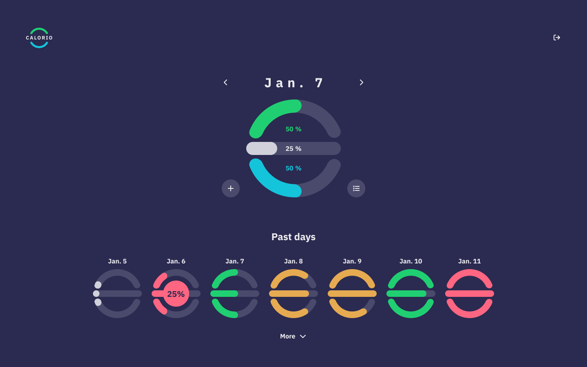
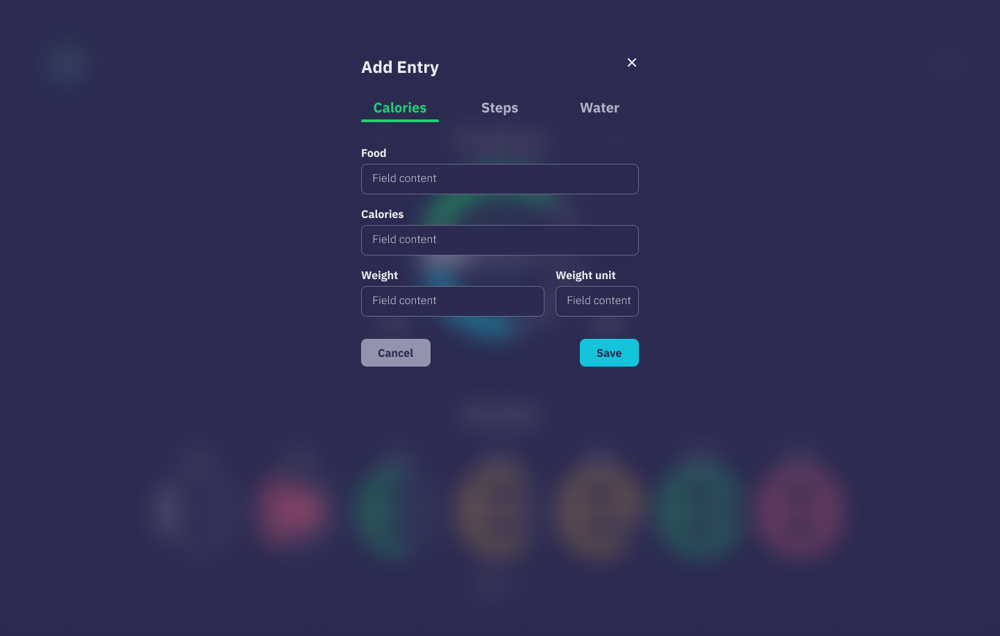
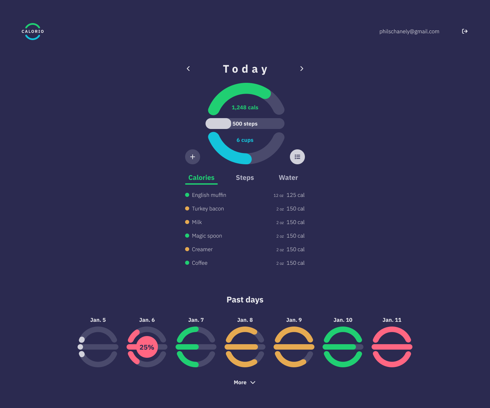

# Calorio


Calorio allows folks to track their calories, steps, and water consumption each day to help make steady progress towards healthy living.

## Intent

This is a work-in-progress application in which I aim to showcase UI engineering and design skills while also leveraging AI assistance for additional full stack development.

This is a [Next.js](https://nextjs.org) project bootstrapped with [`create-next-app`](https://nextjs.org/docs/app/api-reference/cli/create-next-app).

## Preview








## Getting Started

First, install the dependencies:

```bash
npm install
```

Then run the development server:

```bash
npm run dev
```

Open [http://localhost:3000](http://localhost:3000) with your browser to see the result.
